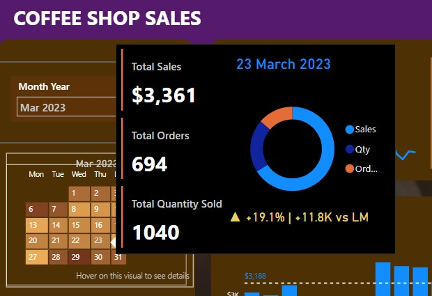

# ☕ Coffee Shop Sales Analysis Dashboard

## 📌 Project Overview
This project presents an end-to-end sales analysis for a coffee shop using **SQL and Power BI**.
The objective is to analyze monthly performance, understand daily sales behavior, and uncover
customer purchase patterns through interactive visualizations.

---

## 🛠 Tools & Technologies
- **SQL (MySQL)** – Data cleaning and preprocessing
- **Power BI** – Data modeling, DAX calculations, and dashboard development
- **Microsoft Excel** – Source dataset

---

## 📊 Dashboard Features

### 🔹 Key Performance Indicators (KPIs)
- Total Sales
- Total Orders
- Total Quantity Sold
- Month-on-Month (MoM) comparison with percentage and absolute change

### 🔹 Calendar Heat Map
- Dynamic calendar view based on the selected month
- Color intensity represents daily sales volume
- **Custom tooltips** displaying Sales, Orders, and Quantity on hover

### 🔹 Daily Sales Trend
- Bar chart showing day-wise sales for the selected month
- Average daily sales line to identify above/below average performance

### 🔹 Weekday vs Weekend Analysis
- Sales segmentation into weekdays and weekends
- Insights into customer purchasing behavior

---

## 📸 Dashboard Screenshots

### 🔹 Overall Dashboard View

### 🔹 Calendar Heat Map with Tooltip

---
## 📂 Repository Structure
- Dashboard/ → Power BI dashboard (.pbix)
- Dataset/ → Raw coffee shop sales dataset
- SQL/ → SQL script used for data cleaning
- Screenshots/ → Dashboard screenshots

---

## 🧠 SQL Data Preparation
SQL was used for initial data cleaning and preparation tasks, including:
- Converting date and time columns into proper formats
- Fixing column encoding issues
- Preparing clean, analysis-ready data for Power BI

---

## 📈 Key Business Insights
- Sales declined by approximately **6.8% in February 2023** compared to the previous month
- **Weekday sales contribute nearly 70%** of total revenue
- Several days consistently exceed the average daily sales, indicating peak demand periods

---

## 🚀 How to Use
1. Download the Power BI `.pbix` file from the **Dashboard** folder
2. Open it using **Power BI Desktop**
3. Use the month slicer to interact with the dashboard and explore insights

---

## 📬 Contact
**Anuj Pratap Singh**  
B.Tech in Information Technology, NIT Srinagar  
📧 Email: anujpratap8403@gmail.com
